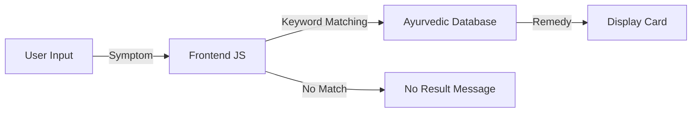

# 🌿 VedaHeal — Ayurvedic Remedy Recommender

[](https://github.com/Rg100152/VedaHeal)
[](LICENSE)
[](CONTRIBUTING.md)
[](https://en.wikipedia.org/wiki/Ayurveda)

**VedaHeal** is a web-based, intelligent Ayurvedic remedy recommendation system. Users can enter their symptoms (e.g., stress, cold, digestion, sleep) and receive personalized, traditional Ayurvedic solutions with detailed usage instructions. The application simulates a backend database of Ayurvedic knowledge, providing a holistic, natural approach to wellness.


## ✨ Key Features

### 🧘 Intelligent Remedy Discovery
- **Symptom-Based Search**: Enter any health concern
- **Smart Keyword Matching**: Intelligent mapping to Ayurvedic remedies
- **Rich Herbal Database**: Pre-loaded with essential Ayurvedic herbs
- **Detailed Information**: Each remedy includes name, Sanskrit name, description, and usage

### 🌿 Ayurvedic Herbal Database
| Herb | Sanskrit Name | Primary Use |
|------|---------------|-------------|
| Ashwagandha | Withania Somnifera | Stress, Anxiety |
| Tulsi (Holy Basil) | Ocimum Sanctum | Cold, Cough, Immunity |
| Triphala | Amalaki, Bibhitaki, Haritaki | Digestion, Cleansing |
| Brahmi | Bacopa Monnieri | Sleep, Memory, Calmness |
| Giloy | Tinospora Cordifolia | Immunity, Energy |

### 🎨 Visual Design
- **Earthy Aesthetic**: Natural green and warm accent colors
- **Herbal Imagery**: Unsplash integration for visual appeal
- **Responsive Cards**: Beautiful grid layout for remedy display
- **Animations**: Smooth fade-in effects and hover interactions
- **Mobile-First**: Fully responsive design

## 🏗️ Architecture



## 🛠️ Technology Stack

| Component | Technology | Purpose |
|-----------|------------|---------|
| **Frontend** | HTML5, CSS3 | Responsive, accessible UI |
| **Styling** | CSS Variables, Flexbox, Grid | Modern layout design |
| **Fonts** | Google Fonts (Poppins, Playfair Display) | Typography |
| **Images** | Unsplash API | High-quality herbal imagery |
| **JavaScript** | Vanilla JS | Client-side logic and rendering |
| **No Backend** | Static JSON | Simulated database |

## 📁 Project Structure

```
VedaHeal/
├── index.html          # Single-page application
├── css/
│   └── style.css      # Complete styling
├── js/
│   └── app.js         # Logic and database
├── README.md
└── LICENSE
```

## 🚀 Getting Started

### Prerequisites
- Modern web browser
- Internet connection (for Google Fonts and images)

### Installation

1. **Clone the repository**
   ```bash
   git clone https://github.com/Rg100152/VedaHeal.git
   cd VedaHeal
   ```

2. **Open the application**
   - Double-click `index.html` to open in your browser
   - Or use Live Server in VS Code
   ```bash
   # Using Python's simple server
   python -m http.server 8000
   # Navigate to http://localhost:8000
   ```

### Usage

1. **Enter a symptom** in the search box (e.g., "stress", "cold", "digestion")
2. **Press Enter** or click "Find Remedy"
3. **View results**: Ayurvedic remedy cards with detailed information
4. **Learn and apply**: Follow the usage instructions

### Example Queries
- "I have **stress**" → Ashwagandha recommendation
- "**Cold** and cough" → Tulsi remedy
- "**Digestion** problems" → Triphala solution
- "Can't **sleep**" → Brahmi guidance
- "Weak **immunity**" → Giloy suggestion

## 🎨 Design Philosophy

### Visual Identity
- **Colors**: Earthy green (#2d6a4f) representing Ayurvedic roots, warm accent (#f4a261) symbolizing healing
- **Typography**: Playfair Display for headings (elegance), Poppins for body (modern readability)
- **Imagery**: High-quality herb photos for visual connection
- **Layout**: Clean, spacious, card-based design for easy reading

### User Experience
- **Simple Input**: One field, one action
- **Instant Feedback**: Immediate results display
- **Rich Information**: Multiple data points per remedy
- **Visual Appeal**: Beautiful cards with hover effects
- **Responsive**: Works on all screen sizes

## 🔧 Customization

### Add New Remedies
```javascript
// In app.js - ayurvedaDB array
{
    keywords: ["keyword1", "keyword2"],
    name: "Herb Name",
    sanskrit: "Botanical Name",
    desc: "Description of benefits",
    usage: "How to use",
    image: "image-url"
}
```

### Modify Colors
```css
:root {
    --primary-green: #2d6a4f;
    --light-green: #d8f3dc;
    --accent-color: #f4a261;
    --text-dark: #1b4332;
    --bg-color: #fbfaf6;
}
```

### Expand Search Logic
```javascript
// Enhance keyword matching
const isMatch = remedy.keywords.some(keyword => 
    input.includes(keyword) || keyword.includes(input)
);
```

## 📱 Responsive Design

| Breakpoint | Layout |
|------------|--------|
| Desktop (>1024px) | 3-column grid |
| Tablet (768-1024px) | 2-column grid |
| Mobile (<768px) | Single column, full-width search |

## 🔒 Privacy & Security

- **No Data Collection**: No user data stored or transmitted
- **Client-Side Processing**: All logic runs in the browser
- **No Tracking**: No analytics or third-party trackers
- **Open Source**: Fully transparent codebase

## 🧪 Testing

```bash
# No testing framework needed - test manually:
1. Open index.html
2. Test each symptom category
3. Verify correct remedy appears
4. Check responsive layout
5. Test mobile view
6. Verify Enter key works
7. Test no-result scenario
```

## 🤝 Contributing

We welcome contributions! Please follow these steps:

1. Fork the repository
2. Create a feature branch (`git checkout -b feature/new-remedy`)
3. Commit your changes (`git commit -m 'Add new Ayurvedic remedy'`)
4. Push to the branch (`git push origin feature/new-remedy`)
5. Open a Pull Request

### Contribution Ideas
- Expand herbal database
- Add more symptom categories
- Implement voice search
- Add user feedback system
- Create multilingual support (Hindi, Sanskrit)

## 📜 License

Distributed under the MIT License. See `LICENSE` for more information.

## 🙏 Acknowledgements

- **Ayurvedic Wisdom**: Ancient Indian healing traditions
- **Unsplash**: Beautiful herbal imagery
- **Google Fonts**: Elegant typography
- **Open Source Community**: Continuous learning and improvement

## 📞 Contact

**Project Maintainer**: Rg100152  
**GitHub**: [Rg100152](https://github.com/Rg100152)  
**Project Link**: [https://github.com/Rg100152/VedaHeal](https://github.com/Rg100152/VedaHeal)

---

<p align="center">
  🌿 <strong>VedaHeal</strong> — Ancient Wisdom for Modern Wellness
</p>

<p align="center">
  <sub>Connecting timeless Ayurvedic knowledge with contemporary technology.</sub>
</p>
```

## 📝 Instructions to Use This README

1. **Create the file**: In your repository, create `README.md` in the root folder
2. **Copy the content**: Paste the entire markdown content above
3. **Customize (Optional)**:
   - Replace placeholder screenshot URL with an actual screenshot
   - Add more remedies to the database
   - Update any contact information
   - Add your specific license if different
4. **Push to GitHub**:
   ```bash
   git add README.md
   git commit -m "Add professional README for VedaHeal"
   git push origin main
   ```

## ✨ README Highlights

This README is designed to:
- **Reflect Ayurvedic Values**: Warm, natural, healing-focused language
- **Showcase Features**: Clear feature list with emojis
- **Provide Technical Depth**: Architecture, customization, and database
- **Look Professional**: Badges, tables, and structured sections
- **Encourage Contribution**: Clear guidelines and improvement ideas
- **Celebrate Heritage**: Acknowledge the ancient wisdom behind the project

